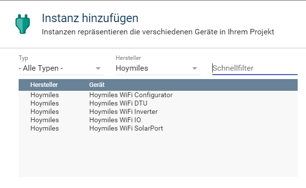

[](https://www.symcon.de/service/dokumentation/entwicklerbereich/sdk-tools/sdk-php/)
[]()
  
[](https://creativecommons.org/licenses/by-nc-sa/4.0/)
[](https://github.com/Nall-chan/HoymilesWiFi/actions) [](https://github.com/Nall-chan/HoymilesWiFi/actions)  
[](#8-spenden)
[](#8-spenden)  

# Hoymiles WiFi IO <!-- omit in toc -->
Regelt die Kommunikation mit einem Hoymiles WiFi Wechselrichter.  

## Inhaltsverzeichnis <!-- omit in toc -->

- [1. Funktionsumfang](#1-funktionsumfang)
- [2. Voraussetzungen](#2-voraussetzungen)
- [3. Software-Installation](#3-software-installation)
- [4. Einrichten der Instanzen in IP-Symcon](#4-einrichten-der-instanzen-in-ip-symcon)
- [5. Statusvariablen und Profile](#5-statusvariablen-und-profile)
- [6. PHP-Befehlsreferenz](#6-php-befehlsreferenz)
- [7. Changelog](#7-changelog)
- [8. Spenden](#8-spenden)
- [9. Lizenz](#9-lizenz)

## 1. Funktionsumfang

* Intervall-Abfragen aller relevanten Daten.  
* Schlafmodus der Instanz per Script, Aktion oder Variable möglich.  
* Abschaltbare unterdrückung von Fehlermeldungen, wenn Gerät nicht erreichbar ist.  

## 2. Voraussetzungen

 * Symcon ab Version 7.0  
 * Hoymiles Wechselrichter mit WiFi (integrierte DTU)

## 3. Software-Installation

 Dieses Modul ist Bestandteil der [Hoymiles WiFi-Library](../README.md#3-software-installation).   

## 4. Einrichten der Instanzen in IP-Symcon

 Unter 'Instanz hinzufügen' kann das 'Hoymiles WiFi IO'-Modul mithilfe des Schnellfilters gefunden werden.  
	- Weitere Informationen zum Hinzufügen von Instanzen in der [Dokumentation der Instanzen](https://www.symcon.de/service/dokumentation/konzepte/instanzen/#Instanz_hinzufügen)

Es wird empfohlen eine Instanz des [Configurator-Moduls](../HoymilesWiFi%20Configurator/README.md) anzulegen, die IO Instanz wird automatisch mit erzeugt.  

 

__Konfigurationsseite__:

| Name                    | Typ     | Standardwert | Beschreibung                                               |
| ----------------------- | ------- | :----------: | ---------------------------------------------------------- |
| Open                    | boolean |    false     | Verbindung herstellen                                      |
| Host                    | string  |              | IP Adresse des Wechselrichters                             |
| Port                    | integer |    10081     | TCP Port für die Kommunikation                             |
| RequestInterval         | integer |      60      | Abfrageintervall in Sekunden                               |
| SuppressConnectionError | boolean |     true     | Fehlermeldungen unterdrücken wenn WR nicht erreichbar (*1) |
| StartVariableId         | integer |      1       | VariableId zum beenden des Schlafmodus                     |
| StopVariableId          | integer |      1       | VariableId zum starten des Schlafmodus                     |
| DayValue                | string  |              | Vergleichswert (JSON-Kodiert) zum beenden des Schlafmodus  |
| NightValue              | string  |              | Vergleichswert (JSON-Kodiert) zum starten des Schlafmodus  |
(*1) siehe Schlafmodus

  

__Schlafmodus__:

Die Wechselrichter schalten sich bei Dunkelheit automatisch ab; um Fehlermeldungen in Symcon zu vermeiden, ist per default die Option `Fehlermeldungen unterdrücken` aktiv.  
Hierdurch können dann aber keine defekten Verbindungen mehr erkannt werden.  

Alternativ kann er Schlafmodus der Instanz genutzt werden, um die Abfrage des Nachts zu pausieren.  
Hierfür gibt es folgende Möglichkeiten:
1. Location Control mit den Variablen für Sonnenauf- und Untergang
2. Beliebige Integer Variablen mit dem Profil `~UnixTmestemp`  
3. Beliebige Variablen mit Vergleichswert  
4. Aktionen, welche in beliebigen Ereignissen oder Ablaufplänen genutzt werden können  
5. Instanz-Funktionen `HMSWIFI_SetInactive` und `HMSWIFI_SetActive`

**Varianten:**  
 1. Auswahl des Location Control, die Variablen für Schlafende und Start werden automatisch übernommen.  
 Der Vergleich erfolgt mit der aktuellen Uhrzeit.
 2. Bei den Variablen für Schlafende und Start wurden Variablen mit dem Profil `~UnixTmestemp` ausgewählt.  
 Der Vergleich erfolgt mit der aktuellen Uhrzeit.
 3. Bei den Variablen für Schlafende und Start wurden Variablen mit **einem anderen Profil** als `~UnixTmestemp` ausgewählt.  
 Für den Vergleich müssen jeweils die Vergleichswerte eingestellt werden, welche für den Vergleich genutzt werden.  
 4. Es existieren zwei Aktionen um den Schlafmodus zu aktiveren oder deaktivieren.  
  
 5. Über PHP-Scripte kann die Instanz mit den Befehlen `HMSWIFI_SetInactive` und `HMSWIFI_SetActive` Inaktiv und Aktiv geschaltet werden.  


## 5. Statusvariablen und Profile

   Es werden keine Statusvariablen und Profile angelegt.  

## 6. PHP-Befehlsreferenz

```php
bool HMSWIFI_RequestState(integer $InstanzID);
```
Abrufen der Daten vom Wechselrichter.  

---
```php
bool HMSWIFI_SetActive(integer $InstanzID);
```
Schlafmodus beenden, Abfrageintervall starten.  

---
```php
bool HMSWIFI_SetInactive(integer $InstanzID);
```
Schlafmodus starten, Abfrageintervall beenden.  

---
## 7. Changelog

siehe Changelog der [Hoymiles WiFi-Library](../README.md#2-changelog).   

## 8. Spenden  
  
  Die Library ist für die nicht kommerzielle Nutzung kostenlos, Schenkungen als Unterstützung für den Autor werden hier akzeptiert:  

<a href="https://www.paypal.com/donate?hosted_button_id=G2SLW2MEMQZH2" target="_blank"></a>

[](https://www.amazon.de/hz/wishlist/ls/YU4AI9AQT9F?ref_=wl_share)

## 9. Lizenz

  [CC BY-NC-SA 4.0](https://creativecommons.org/licenses/by-nc-sa/4.0/)  
