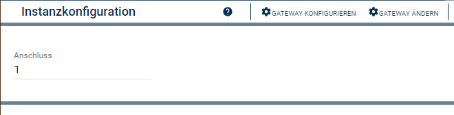

  

   

  

# Hoymiles WiFi SolarPort <!-- omit in toc -->
Anzeigen der Werte eines Solar Anschlusses.

## Inhaltsverzeichnis <!-- omit in toc -->

- [1. Funktionsumfang](#1-funktionsumfang)
- [2. Voraussetzungen](#2-voraussetzungen)
- [3. Software-Installation](#3-software-installation)
- [4. Einrichten der Instanzen in IP-Symcon](#4-einrichten-der-instanzen-in-ip-symcon)
- [5. Statusvariablen und Profile](#5-statusvariablen-und-profile)
  - [Statusvariablen](#statusvariablen)
- [7. PHP-Befehlsreferenz](#7-php-befehlsreferenz)
- [8. Changelog](#8-changelog)
- [9. Spenden](#9-spenden)
- [10. Lizenz](#10-lizenz)

## 1. Funktionsumfang

* Anzeigen der Werte eines Solar Anschlusses.

## 2. Voraussetzungen

 * Symcon ab Version 7.0  
 * Hoymiles Wechselrichter mit WiFi (integrierte DTU)

## 3. Software-Installation

 Dieses Modul ist Bestandteil der [Hoymiles WiFi-Library](../README.md#3-software-installation).    

## 4. Einrichten der Instanzen in IP-Symcon

 Unter 'Instanz hinzufügen' kann das 'Hoymiles WiFi SolarPort'-Modul mithilfe des Schnellfilters gefunden werden.  
	- Weitere Informationen zum Hinzufügen von Instanzen in der [Dokumentation der Instanzen](https://www.symcon.de/service/dokumentation/konzepte/instanzen/#Instanz_hinzufügen)

Es wird empfohlen diese Instanz über die dazugehörige Instanz des [Configurator-Moduls](../HoymilesWiFi%20Configurator/README.md) anzulegen.  

 

__Konfigurationsseite__:

| Name | Typ     | Standardwert | Beschreibung           |
| ---- | ------- | :----------: | ---------------------- |
| Port | integer |      1       | Nummer des Anschlusses |

 

## 5. Statusvariablen und Profile

Die Statusvariablen werden automatisch angelegt. Das Löschen einzelner kann zu Fehlfunktionen führen.

### Statusvariablen

| Name             | Typ   | Profil          | Beschreibung                                      |
| ---------------- | ----- | --------------- | ------------------------------------------------- |
| Spannung         | float | ~Volt.230       | Anliegende Spannung am Anschluss                  |
| Strom            | float | ~Ampere         | Ankommender Strom                                 |
| Leistung         | float | ~Watt           | Aktuelle Leistung der angeschlossene Solar-Module |
| Leistung gesamt  | float | ~Electricity.Wh | Gesamtsumme Leistung                              |
| Leistung täglich | float | ~Electricity.Wh | Summe tägliche Leistung                           |

## 7. PHP-Befehlsreferenz

   Es existieren keine PHP-Befehle für dieses Modul. 
   
## 8. Changelog

siehe Changelog der [Hoymiles WiFi-Library](../README.md#2-changelog).   

## 9. Spenden  
  
  Die Library ist für die nicht kommerzielle Nutzung kostenlos, Schenkungen als Unterstützung für den Autor werden hier akzeptiert:  

## 10. Lizenz

  [CC BY-NC-SA 4.0](https://creativecommons.org/licenses/by-nc-sa/4.0/)  
