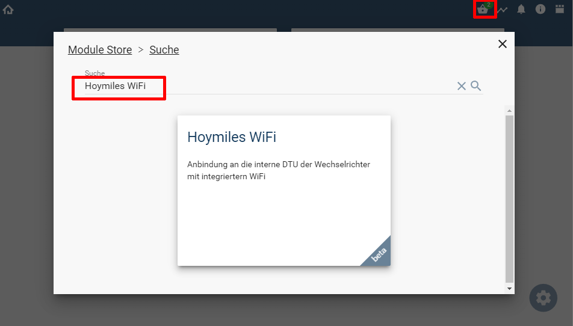

  

   

  

# Hoymiles WiFi Wechselrichter <!-- omit in toc -->  

Integration der Hoymiles Wechselrichter mit integrierten WiFi  
- HMS-600W/700W/800W/900W/1000W-2T (Wi-Fi integrated)
- HMS-300W/350W/400W/450W/500W-1T (Wi-Fi integrated)

## Dokumentation <!-- omit in toc -->

**Inhaltsverzeichnis**
- [1. Funktionsumfang](#1-funktionsumfang)
- [3. Software-Installation](#3-software-installation)
- [4. Einrichten der Instanzen in IP-Symcon](#4-einrichten-der-instanzen-in-ip-symcon)
- [5. Anhang](#5-anhang)
	- [1. GUID der Module](#1-guid-der-module)
	- [2. Changelog](#2-changelog)
- [6. Spenden](#6-spenden)
- [7. Lizenz](#7-lizenz)

## 1. Funktionsumfang

Folgende Module beinhaltet das Hoymiles WiFi Smart Rollos Repository:

- __Hoymiles WiFi IO__ ([Dokumentation](HoymilesWiFi%20IO/README.md))  
	IO Instanz zur Kommunikation mit der integrierten DTU.  

- __Hoymiles WiFi Configurator__ ([Dokumentation](HoymilesWiFi%20Configurator/README.md))  
	Konfigurator Instanz zum auslesen der bekannten Geräte und einfachen anlegen von Instanzen in Symcon.  

- __Hoymiles WiFi DTU__ ([Dokumentation](HoymilesWiFi%20DTU/README.md))  
	Geräte Instanz für die integrierte DTU.  

- __Hoymiles WiFi Inverter__ ([Dokumentation](HoymilesWiFi%20Inverter/README.md))  
	Geräte Instanz für den integrierten Inverter.  

- __Hoymiles WiFi SolarPort__ ([Dokumentation](HoymilesWiFi%20SolarPort/README.md))  
	Geräte Instanz für jeweils einen Anschluss von Solarmodulen.  

	## 2. Voraussetzungen  

 * Symcon ab Version 7.0  
 * Hoymiles Wechselrichter mit WiFi (integrierte DTU)
  
## 3. Software-Installation

  Über den 'Module-Store' in IPS das Modul 'Hoymiles WiFi' hinzufügen.  
   **Bei kommerzieller Nutzung (z.B. als Errichter oder Integrator) wenden Sie sich bitte an den Autor.**  
  

## 4. Einrichten der Instanzen in IP-Symcon

Nach der installation des Modules, muss eine Instanz des [Configurator-Moduls](HoymilesWiFi%20Configurator/README.md) angelegt werden.  
Dadurch wird automatisch der benötigte [IO](HoymilesWiFi%20IO/README.md) erstellt.  

## 5. Anhang

### 1. GUID der Module

|           Modul            |     Typ      |                  GUID                  |
| :------------------------: | :----------: | :------------------------------------: |
|      Hoymiles WiFi IO      |      IO      | {5972AA13-358F-A088-CEBD-207C289C9395} |
| Hoymiles WiFi Konfigurator | Configurator | {4062635D-2680-4A39-C364-05EB8B196DA9} |
|     Hoymiles WiFi DTU      |    Device    | {BB414362-B36F-81C5-2701-E968A29F58AD} |
|   Hoymiles WiFi Inverter   |    Device    | {52D8E128-5588-B496-4BE5-14E8EFD737B8} |
|  Hoymiles WiFi SolarPort   |    Device    | {65B18475-D1B7-825C-5958-5300C1100845} |

### 2. Changelog

**Version 1.0:**  

 - Erstes Release nach Beta  

## 6. Spenden  
  
  Die Library ist für die nicht kommerzielle Nutzung kostenlos, Schenkungen als Unterstützung für den Autor werden hier akzeptiert:  

## 7. Lizenz

  [CC BY-NC-SA 4.0](https://creativecommons.org/licenses/by-nc-sa/4.0/)  
